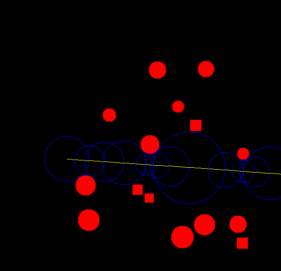

<h1 align="center">Raymarcher</h1>

  

        

Raymarcher is a small ray-marching graphical demo in 2D Java. A ray-marcher is an evolution from contemporary raycasting algorithms that check each point along the ray. Ray marching extends a ray out only as far as it needs to before generating an extension.

## Dependencies

This program uses my Theta library. The JAR file is located [here](https://github.com/JoshuaCrotts/Theta/blob/master/lib/Theta.jar).

# Rebuilding Raymarcher

Clone the repository to your computer, and add the Theta.jar file to your build path. Press A and D to pan the camera around, and click anywhere on the screen to move the starting vertex/camera.

## Reporting Bugs

See the Issues Tab.

## Version History

The **master** branch encompasses all changes.

